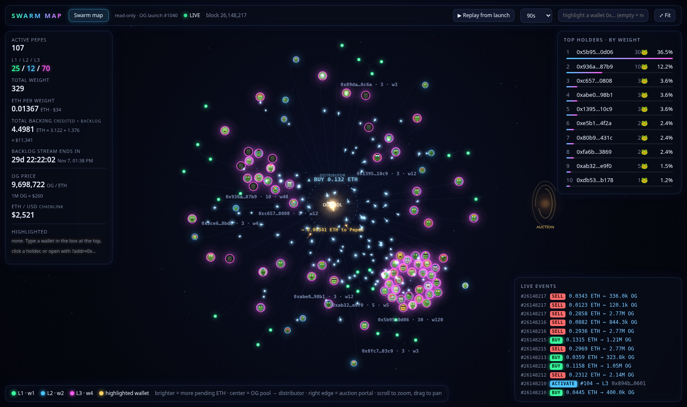

# OG · Swarm map

A live, read-only visualizer for the **OG** token launch (IMD launch #1040) and its **Swarm Pepe** distributor on Ethereum mainnet.

Every active Swarm Pepe is a glowing node, clustered around the wallet that owns it. Each OG trade sends a pulse from the pool core through the distributor out to the Pepes, weighted by how much each one earns.



**No wallet, no keys, no transactions.** The page only reads public chain data through a free public RPC (`eth_call`, `eth_getLogs`, `eth_blockNumber`). It never asks for a wallet connection and never signs anything.

## What you see

- **Nodes = active Pepes.** Colour and size show the level: green **L1** (weight 1), blue **L2** (weight 2), magenta **L3** (weight 4). Brighter nodes have more pending ETH. Each node shows the Pepe's on-chain pixel art, which comes straight from the NFT's `tokenURI`, so nothing is fetched from external image hosts.
- **Clusters = owner wallets**, packed in a golden-angle spiral with the biggest holders closest to the core.
- **Center = OG pool core + distributor ring. Right edge = auction portal.**
- **Live events**, polled about every 12s:
  - **Buy or sell** (v4 PoolManager `Swap` for the OG pool): a pulse from the core, with the ETH amount shown.
  - **Fees reaching the distributor** (`RewardsReceived`): particle streams to every Pepe, weighted by its weight.
  - **Activation or upgrade:** a node spawns or grows with a flash.
  - **Exit:** the node flies into the auction portal.
- **HUD:**
  - active Pepes and the L1/L2/L3 split
  - total weight and ETH per weight
  - total ETH backing: credited `pending` plus `backlogLeft`
  - a countdown to the end of the backlog stream
  - OG price from pool `slot0`, and ETH/USD from Chainlink
  - a top-holders leaderboard
  - an event ticker with Etherscan links
  - hover tooltips: id, owner, level, pending ETH, backlog share, exit unlock time, traits
- **Replay from launch:** plays back every event since deploy block `26147432`, sped up, so the swarm grows from zero.
- **Highlight a wallet:** `?addr=0x…`, the input box, or click a leaderboard row. Nothing is highlighted by default, and your choice is remembered in this browser's localStorage only.
- Scroll to zoom, drag to pan, double-click or **⤢ Fit** to reset.

## Run locally

Any static file server works. The page must be served over http(s), not opened as `file://`.

```bash
git clone https://github.com/Lavel0rz/og-swarm-pepes.git
cd og-swarm-pepes
python -m http.server 8000
# open http://127.0.0.1:8000/
```

It also works as-is on GitHub Pages or any static host. There's no build step: it's plain JavaScript on a 2D canvas, plus a vendored copy of `ethers.umd.min.js` (ethers v6.13.4, identical to the npm `dist` file). Nothing is loaded from a CDN.

### URL parameters

| Param | Example | Effect |
|---|---|---|
| `addr` | `?addr=0xabc…` | highlight this wallet's Pepes in gold |
| `rpc` | `?rpc=https://your-node.example` | use this RPC instead of the default public list |
| `replay` | `?replay=1` | start the launch replay automatically |

Default RPCs, all public with no API keys: publicnode, llamarpc, ankr, drpc, cloudflare-eth. The page fails over between them.

## Contracts (Ethereum mainnet)

| | Address |
|---|---|
| OG token | [`0xce7eb1ad9e2e1c784ea05f7ea4a0fe625923d10a`](https://etherscan.io/address/0xce7eb1ad9e2e1c784ea05f7ea4a0fe625923d10a) |
| OGHook (Uniswap v4 hook) | [`0x22fded8abce0d93979ebb2a04cfc37c110abe0cc`](https://etherscan.io/address/0x22fded8abce0d93979ebb2a04cfc37c110abe0cc) |
| OGDistributor | [`0xd450ea80aeC46B8bFfdf0C4F44d3964489B613f2`](https://etherscan.io/address/0xd450ea80aeC46B8bFfdf0C4F44d3964489B613f2) |
| OGAuction | [`0xb0d2d2Cfe7A1b14d1f34135C3C7a8d152c4262e9`](https://etherscan.io/address/0xb0d2d2Cfe7A1b14d1f34135C3C7a8d152c4262e9) |
| Swarm Pepe NFT | [`0x999ce0CE8C5f7661e0c74a568FfE27CEB9177bDB`](https://etherscan.io/address/0x999ce0CE8C5f7661e0c74a568FfE27CEB9177bDB) |
| Uniswap v4 PoolManager | [`0x000000000004444c5dc75cB358380D2e3dE08A90`](https://etherscan.io/address/0x000000000004444c5dc75cB358380D2e3dE08A90) |
| OG/ETH pool id | `0x5f95e64cf8e8f4e4376c1d97b5959dc479abf7b191ba0b286faeb2ec4180a2f9` |

Read-only helpers: Multicall3 `0xcA11…CA11`, v4 StateView `0x7fFE…7227`, Chainlink ETH/USD `0x5f4e…8419`.

### How the numbers are computed

- **Active Pepes / weight:** `activePerLevel(1..3)` and `totalWeight()` on the distributor. The node set is rebuilt from `Activated` / `Upgraded` / `Exited` events and cross-checked against current `ownerOf`.
- **Pending ETH per Pepe:** `pending(id)`. Normal fees are credited by weight right away. Launch-tax surplus goes into a backlog that streams linearly until `streamEnd`; the streamed part is already inside `pending`, and the rest is `backlogLeft()`.
- **Total backing** = Σ `pending` over active Pepes + `backlogLeft()`. This matches the distributor's ETH balance to within rounding dust, except for any `unfundedFees`.
- **Backlog share** of a Pepe = `backlogLeft × weight / totalWeight`. It's a projection that assumes the weights stay unchanged.
- ETH is paid to a Pepe only on exit, which is allowed 24h after its last activation or upgrade. The exited NFT goes to the OGAuction.

## Files

- `index.html`: the page (layout, HUD, styles)
- `swarm.js`: data loading (RPC, Multicall3, logs), force layout, rendering, replay
- `ethers.umd.min.js`: vendored ethers v6.13.4
- `favicon.svg`, `screenshot.png`

## Disclaimer

This is an unofficial community visualizer, provided as-is with no warranty. It's not affiliated with IMD, the OG team or Swarm Pepe. Numbers come from public RPCs and can lag, be wrong or be unavailable. Nothing here is financial advice. Always verify on-chain or on Etherscan before acting.

## License

MIT, see [LICENSE](LICENSE).
